# 清淤地圖 - 光復計畫

**版本：** 1  
**日期：** 2025年9月27日  
**摘要：** 本文件為「清淤地圖 - 光復計畫」專案的最終技術規格，涵蓋所有功能需求、系統架構與演算法設計。

## 1. 專案概述

### 1.1 目標

本專案旨在為花蓮縣光復鄉的颱風後清淤工作，提供一個即時、互動的地圖平台。讓在地民眾、救災人員及志工能快速回報與查看指定區域內的淤泥清理狀況，優化資源調度與合作效率。

### 1.2 核心功能

- **精準範圍地圖可視化：** 在指定的 4km x 3km 範圍內，清楚顯示「有淤泥」或「已清除」的狀態網格
- **現場回報：** 使用者需在回報點的物理範圍內，透過行動裝置的 GPS 定位，提交該地點的狀態
- **鎖定中心模式：** 提供一個模式，讓地圖能以使用者的 GPS 位置為中心持續移動
- **固定操作介面：** 畫面下方始終顯示「有淤泥 🪏」和「無淤泥 ✨」兩個主要操作按鈕
- **信任演算法：** 後端自動運行整合了「範圍效應」的信任演算法，判斷出最可信的真實狀態
- **自動更新：** 地圖資料會定期自動更新，反映最新的清理進度

### 1.3 技術架構總覽

- **前端框架：** Next.js
- **UI 元件庫：** shadcn/ui
- **CSS 框架：** Tailwind CSS
- **地圖函式庫：** Leaflet.js (搭配 react-leaflet)
- **全端託管：** Vercel (包含前端與 API)
- **SQL 資料庫：** Supabase (PostgreSQL)
- **記憶體快取：** Upstash (Redis)
- **背景任務：** GitHub Actions
- **檔案儲存 & CDN：** Cloudflare R2

## 2. 系統架構

系統採用前後端分離、事件驅動的架構。使用者互動由 Vercel 處理，而耗時的地圖資料生成則由 GitHub Actions 異步處理。

```mermaid
graph TD
    subgraph Browser
        A[Next.js App @ Vercel] --> B[API: /api/report]
        A --> G[Cloudflare CDN]
    end

    subgraph Vercel
        B --> C[Supabase DB]
        B --> D[Upstash Redis]
    end

    subgraph GitHub
        E[Actions Schedule] --> F[Python Script]
    end

    subgraph "Python Script (GH Runner)"
        F --> D
        F --> R2[R2 Storage]
    end

    subgraph Cloudflare
        R2 --> G
    end

    A -.->|1. 回報災情| B
    B -.->|2. 寫入原始紀錄| C
    B -.->|3. 更新即時分數| D
    E -.->|4a. 觸發| F
    F -.->|4b. 讀取分數| D
    F -.->|4c. 生成 & 上傳| R2
    A -.->|5. 讀取版本號 & 圖磚| G
```



## 3. 地圖規格 (Map Specification)

### 3.1 地理範圍 (Geographic Area)

地圖的可回報區域被嚴格限定在以下四個座標點構成的矩形範圍內 (WGS 84)：

- **西北角 (NW):** (23.68137, 121.41771)
- **東北角 (NE):** (23.68108, 121.45639)
- **西南角 (SW):** (23.65397, 121.41760)
- **東南角 (SE):** (23.65396, 121.45657)

### 3.2 尺寸與精度 (Dimensions & Precision)

- **物理尺寸：** 約 4 公里 (寬) x 3 公里 (高)
- **網格精度：** 5 公尺 x 5 公尺
- **網格維度：** 800 格 (寬) x 600 格 (高)
- **總網格數：** 480,000 個

## 4. 前端規格 (Frontend)

### 4.1 技術架構與設計系統

- **UI 元件庫:** 採用 shadcn/ui 來建構使用者介面元件，以獲得高品質、可組合且易於客製化的元件
- **CSS 框架:** 所有樣式應使用 Tailwind CSS 實現，以確保快速、一致且響應式的設計
- **圖示庫:** 介面中的圖示（如定位鎖定圖示）建議使用 lucide-react，它與 shadcn/ui 完美整合

### 4.2 使用者介面與核心功能

#### 1. 地圖主視圖

- 地圖初始化時，應以 3.1 節定義的地理範圍為中心和主要視野
- 地圖上疊加由 Cloudflare R2 提供的自訂圖磚 (Tile Layer)

#### 2. 鎖定中心模式 (Lock to Center)

- 介面上需提供一個使用 shadcn/ui Button (設定為 `variant="outline"` 和 `size="icon"`) 和 lucide-react 圖示（例如 navigation 或 locate-fixed）的可切換按鈕
- **關閉時 (預設)：** 使用者可自由拖動和縮放地圖
- **啟動時：** 地圖視野會以使用者的 GPS 位置為中心。當使用者移動時，地圖會跟隨移動，始終保持使用者的位置標記在畫面正中央。此模式下，使用者不可手動拖動地圖

#### 3. 固定回報按鈕 (Persistent Report Buttons)

在畫面的下方，應始終覆蓋著一個使用 Tailwind CSS 定位的操作列 (e.g., `fixed bottom-4 left-1/2 -translate-x-1/2 flex gap-4 z-[1000]`)。

操作列上包含兩個使用 shadcn/ui Button 元件的主要按鈕：**[有淤泥 🪏]** 和 **[無淤泥 ✨]**。按鈕應有合適的大小 (`size="lg"`) 以便於在行動裝置上點擊。

### 4.3 核心互動流程

1. 應用程式載入，非同步請求 `version.json`
2. 初始化 Leaflet 地圖，並根據版本號載入圖磚
3. 請求使用者 GPS 授權，並啟動 `watchPosition` 來持續追蹤位置
4. 使用者點擊下方按鈕，應用程式將當前 GPS 位置與所選狀態 (0 或 1) 發送到後端 API
5. 使用 shadcn/ui 的 Toast 元件，以非侵入式的方式顯示操作成功或失敗的提示訊息

## 5. 信任演算法規格 (Trust Algorithm Specification)

本專案採用「清淤進度信譽演算法 (Cleanup Progress Trust Algorithm)」，並整合了「範圍效應更新 (Area-of-Effect Update)」機制。

### 5.1 核心資料

為每個網格點 (Grid Cell) 維護以下資料於 Upstash Redis：

- **Score_0 (float):** 「已清除」的信譽分數
- **Score_1 (float):** 「有淤泥」的信譽分數
- **last_update_0 (timestamp):** Score_0 最後更新時間
- **last_update_1 (timestamp):** Score_1 最後更新時間

### 5.2 權重計算

每次回報都會計算一個基礎權重 W。

- **GPS 鄰近度因子 (F_gps):** `(1 - 距離 / 最大允許範圍)^2`。最大允許範圍可設為 50 公尺
- **時間密度抑制因子 (F_spam):** `1 / (1 + 60秒內附近2公尺的回報數)`
- **基礎權重 (W):** `F_gps * F_spam`

### 5.3 範圍效應更新 (Area-of-Effect Update)

單次回報將會對使用者所在的網格點及其周圍8個相鄰網格點（構成一個3x3的九宮格）都產生影響。

**定義：**

- **中心點 (Center Cell):** 使用者GPS經緯度轉換後直接對應的網格點 (x, y)
- **鄰近點 (Neighbor Cells):** 環繞在中心點周圍的8個網格點
- **潑濺因子 (Splash_Factor):** 0.3

**執行流程：**

1. 計算出本次回報的最終基礎權重 W
2. 確定中心點 (x, y) 及其8個鄰近點
3. 對中心點使用 100% 的權重 W 執行更新
4. 對每個鄰近點使用 30% 的權重 `W * 0.3` 執行更新
5. 更新邏輯遵循以下的非對稱規則

### 5.4 非對稱更新邏輯 (Asymmetric Update Logic)

**當回報為「1 - 有淤泥」時：**

- 對 Score_1 進行時間衰減：`Score_1 = Score_1 * exp(-k * Δt)`
- 增加 Score_1：`Score_1 = Score_1 + 更新權重`
- Score_0 保持不變

**當回報為「0 - 已清除」時：**

- 大幅增加 Score_0：`Score_0 = Score_0 + (更新權重 * 5)` (乘以5倍獎勵係數)
- 懲罰性清空 Score_1：`Score_1 = Score_1 * 0.1` (分數銳減90%)
- Score_0 永不進行時間衰減

### 5.5 最終狀態判斷

- 如果 `Score_0 > Score_1`，則該網格點的最終狀態為 0 (已清除)
- 否則，狀態為 1 (有淤泥)

## 6. 後端 API 規格 (Backend)

**端點：** `POST /api/report`

**Request Body (JSON):** `{ "lat": Number, "lon": Number, "state": Number }`

### 核心邏輯：

#### 1. 驗證請求 (Validation)

檢查請求 Body 是否包含 `lat`, `lon`, `state` 且格式正確。

#### 2. 座標轉換與邊界檢查 (Coordinate Transformation & Boundary Check)

- 將接收到的 `lat`, `lon` 轉換為基於 3.1 節地圖範圍的網格座標 (x, y)
- 檢查 (x, y) 是否在 (0..799, 0..599) 的有效範圍內。若超出範圍則拒絕請求

#### 3. 執行範圍效應更新 (Area-of-Effect Update)

- 確定中心點 (x, y) 及周圍8個鄰近點的座標
- 使用 Redis Pipeline，一次性讀取這最多9個網格點的現有分數資料
- 在後端計算每個點的新分數，應用 5.3 和 5.4 節的演算法邏輯
- 使用另一個 Redis Pipeline，一次性將這9個點的新分數寫回

#### 4. 儲存原始紀錄 (Log Original Report)

將本次回報的原始資料（包含精確經緯度、中心網格座標、狀態和時間戳）非同步存入 Supabase 的 reports 資料表中。此操作不應阻塞對使用者的回應。

#### 5. 回應 (Response)

- 成功處理後，向前端返回 200 OK 及成功訊息
- 若有任何錯誤，返回對應的 HTTP 錯誤碼及錯誤訊息

## 7. 資料庫、背景任務與儲存

### 7.1 Supabase (PostgreSQL)

**Table: reports**

| 欄位           | 型別                     | 說明          |
| -------------- | ------------------------ | ------------- |
| id             | bigint                   | Primary Key   |
| created_at     | timestamp with time zone | default now() |
| grid_x         | integer                  | 網格 X 座標   |
| grid_y         | integer                  | 網格 Y 座標   |
| reported_state | smallint                 | 0 或 1        |
| location       | geography(Point, 4326)   | PostGIS 型別  |

**索引 (Indexing):** 建議在 `location` 欄位上建立地理空間索引 (GIST)，以加速未來可能的地理位置查詢。

### 7.2 GitHub Actions (背景任務)

**觸發器：** schedule (每 5 分鐘) 和 workflow_dispatch (手動)

**腳本：** `scripts/generate_tiles.py` (Python)

#### 核心任務邏輯：

1. **初始化：** 從 GitHub Secrets 載入所有服務的金鑰並建立客戶端連線
2. **讀取狀態：** 使用 Redis Pipeline 批次讀取所有 480,000 個網格點的 state 欄位
3. **生成主圖片：**
   - 將讀取到的狀態填入一個 800x600 的 NumPy 陣列
   - 使用 Pillow 將 NumPy 陣列轉換為索引色 (mode='P') 的圖片物件，並套用調色盤（例如：狀態0=灰色，狀態1=紅色）
4. **切割圖磚：** 將 800x600 的主圖片切割成多個 256x256 的 PNG 圖磚
5. **上傳圖磚：**
   - 以當前的 Unix 時間戳作為 version
   - 使用 boto3 SDK 將所有圖磚並行上傳到 Cloudflare R2 的 `/[version]/z/x/y.png` 路徑下
6. **更新版本號：** 生成一個 `version.json` 檔案（內容為 `{"version": "..."}`），並上傳到 R2 的根目錄，覆蓋舊檔案，以通知前端有新圖磚可用

### 7.3 Cloudflare R2 (檔案儲存 & CDN)

**公開網域：** 需設定一個子網域 (e.g., tiles.yourdomain.com) 指向 R2 Bucket，並設定 Bucket 策略為允許公開讀取。

**檔案結構：**

```
/version.json
/[version_timestamp]/[z]/x/[y].png
```
